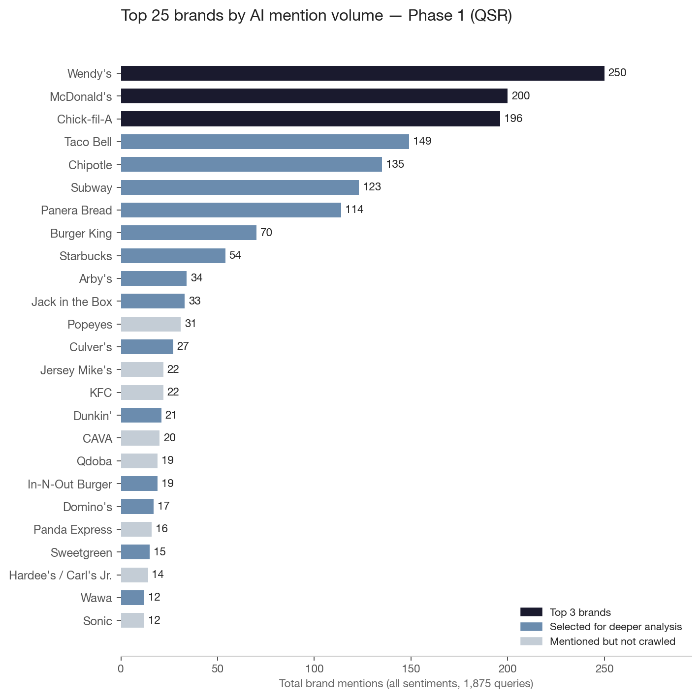
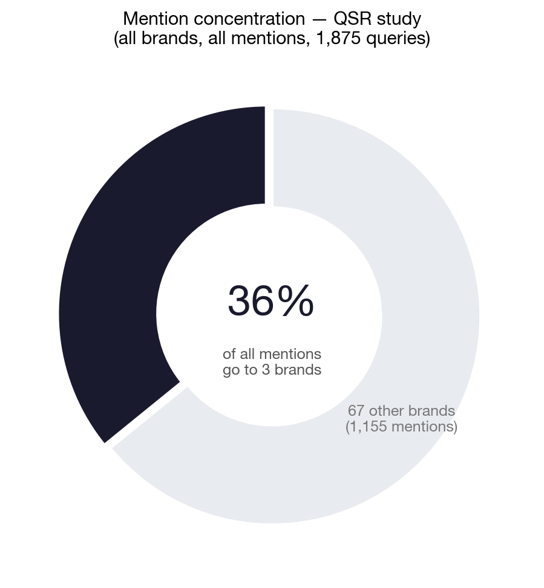
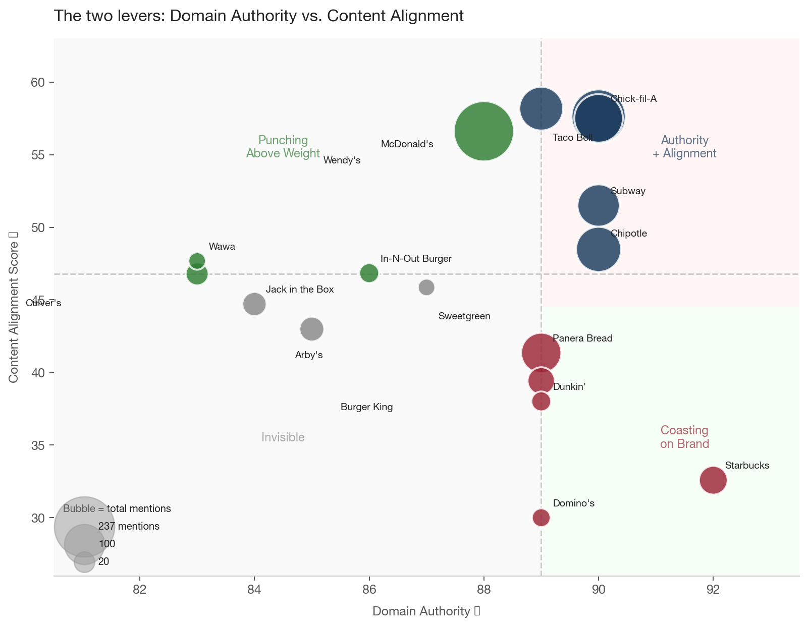
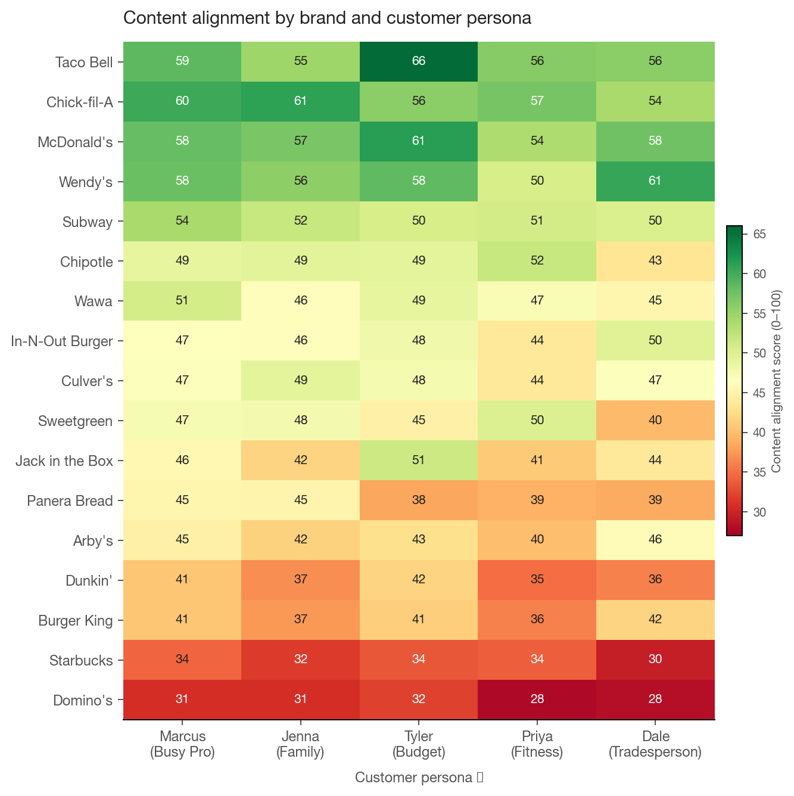

# How AI Recommends Your Brand — And What You Can Do About It

*Two phases. 750 queries. Ten buyer personas. One consistent pattern.*

---

## Executive Summary

We ran a controlled experiment asking ChatGPT the kinds of questions real buyers ask — about fast food, and about marketing agencies — using detailed buyer personas to simulate how different people actually search. Here is what we found.

**1. The AI doesn't recommend "the best" brand. It recommends the brand that fits the buyer.** Across both markets, the single strongest predictor of which brand gets recommended isn't size, familiarity, or domain authority — it's how well the AI's mental model of that brand matches the specific buyer asking the question. Chick-fil-A gets recommended to the busy professional because ChatGPT associates it with speed, app ordering, and consistency. Arby's gets recommended to the tradesperson because the AI associates it with taste, protein, and value. Same brands. Different reasons. Different buyers.

**2. In fragmented markets, the routing divergence is extreme.** The five agency buyer personas in this study were recommended almost entirely different agencies. Refine Labs appears 43 times for the startup founder — and zero times for the franchise development VP. Franchise Performance Group appears 34 times for the franchise development VP — and zero times for the startup founder. The AI has built distinct mental models for each buyer type, and it routes accordingly.

**3. In a sample of the most-mentioned brands, website content alignment predicts persona-specific routing.** We crawled 17 QSR brands and 15 agencies and measured how closely each brand's website language matches what ChatGPT says about it for each buyer type. Content alignment correlates with persona-specific recommendation frequency at ρ = +0.65 across all QSR brand-persona pairs. The data is consistent with the hypothesis that the language a brand uses online influences which buyers the AI routes to it.

**4. The content gap is actionable; the authority gap mostly isn't.** Domain authority and content alignment are nearly uncorrelated with each other (ρ ≈ 0.09 in the QSR data). A brand can have high authority and low alignment — or low authority and high alignment. The authority gap takes years to close. The content gap can be addressed this quarter.

---

## How This Study Works

### Two phases, two questions

**Phase 1 — Observation:** What does ChatGPT actually do when asked buyer questions?

We built ten detailed buyer personas — five for the QSR market, five for the marketing agency market — representing real archetypes who make decisions in each category. For QSR: Marcus (time-pressed professional), Jenna (health-conscious suburban parent), Tyler (budget-driven college student), Priya (macro-tracking fitness enthusiast), and Dale (value-focused tradesperson). For agencies: Jordan (Series A startup founder), Sandra (mid-market VP of Marketing), Ray (multi-location dental practice owner), Christine (franchise brand marketing director), and Derek (franchise development VP).

For each persona, we ran 25 questions spanning five intent types — spontaneous recommendations, need-based queries, direct comparisons, discovery questions, and planning scenarios. Each question was asked three times to measure consistency. That's 375 queries per study, 750 total.

We tracked every brand mentioned in every response — not just the brands we had in mind going in, but every brand ChatGPT referenced. We also captured the *attributes* the AI associated with each brand: the reasoning it used to recommend one brand over another for a specific buyer. Phase 1 produced 1,598 positive brand mentions across 68 distinct QSR brands, and 1,598 mentions across 407 distinct agency brands.

**Phase 2 — Hypothesis test:** Does website language predict AI routing?

Phase 1 generated a specific hypothesis: if the AI routes different buyers to different brands based on conceptual fit, then brands whose website language more closely mirrors the AI's language for a given buyer type should get recommended to that buyer more often.

To test it, we crawled the websites of the most-mentioned brands from Phase 1 — 17 QSR brands and 15 agencies by overall mention count — and embedded both the brand content and the AI's responses using OpenAI's text-embedding-3-large model (3,072 dimensions). We then measured cosine similarity between each brand's content and each persona's response corpus. We call this the **content alignment score**, scaled 0–100.

**One important note on scope:** Phase 2 is a sample-based test, not a comprehensive measurement. The alignment scores tell us about the content-routing relationship for the crawled sample — not the full 70-brand or 403-brand universe Phase 1 revealed.

**One important note on causality:** A high content alignment score doesn't prove a brand's website directly caused the AI to recommend it. The relationship may run in either direction — or both. But the recommended action (closing the content gap) is directionally correct under either interpretation. And as RAG becomes more standard in AI assistants, the pathway from on-page content to AI recommendation is becoming increasingly direct.

---

## Phase 1: What the AI Does When Left to Its Own Devices

### The QSR Market: Familiar Names, Surprisingly Personal Routing

Across 375 queries in the QSR study, ChatGPT mentioned 68 distinct brands. The distribution is heavily concentrated: three brands — Wendy's, Chick-fil-A, and McDonald's — captured 577 of 1,598 total mentions (36%) despite being just 3 of 68 brands that appeared. The next tier (Taco Bell, Chipotle, Subway, Panera Bread) takes another large share. Below that, brands appear occasionally and persona-specifically.

But the raw counts only tell part of the story. The more interesting signal is *why* the AI recommends each brand — and to whom.

**The AI reasons out loud.** Every recommendation comes with attributes: the characteristics the AI associates with each brand for that specific buyer's question. Chick-fil-A gets recommended to Marcus (the busy professional) for speed, app ordering, and consistency — not taste or value, which are how the AI frames the same brand for other personas. Those attributes are a window into the AI's mental model of each brand, per buyer type.

The tables below show the top 10 brands per persona and the attributes most commonly associated with each recommendation.

---

#### Marcus — Busy Professional
*237 mentions · 26 distinct brands*

| # | Brand | Mentions | AI associates with Marcus |
|---|---|---|---|
| 1 | Chick-fil-A | 48 | convenience, speed, app, consistency |
| 2 | Wendy's | 41 | convenience, taste, variety, consistency |
| 3 | Panera Bread | 30 | convenience, variety, app, health |
| 4 | McDonald's | 26 | convenience, app, consistency, speed |
| 5 | Chipotle | 21 | convenience, variety, protein, app |
| 6 | Taco Bell | 16 | convenience, value, portability, variety |
| 7 | Subway | 15 | variety, convenience, health, app |
| 8 | Starbucks | 4 | app, convenience, variety, portability |
| 9 | Popeyes | 4 | taste, quality, protein, variety |
| 10 | Culver's | 4 | service, consistency, quality, speed |

*Marcus's world is mobile-first. "App" appears in the top 4 attributes for 7 of his top 10 brands — digital ordering and loyalty programs are the dominant lens through which the AI routes time-pressed professionals. The brand universe is tight: only 26 brands appeared at all, and the top 7 are all major national chains.*

---

#### Jenna — Health-Conscious Parent
*376 mentions · 47 distinct brands*

| # | Brand | Mentions | AI associates with Jenna |
|---|---|---|---|
| 1 | Chick-fil-A | 57 | family-friendly, variety, health, quality |
| 2 | Panera Bread | 47 | variety, health, family-friendly, quality |
| 3 | Wendy's | 39 | variety, family-friendly, health, value |
| 4 | Chipotle | 35 | variety, health, protein, quality |
| 5 | McDonald's | 32 | family-friendly, variety, convenience, value |
| 6 | Subway | 30 | variety, health, family-friendly, protein |
| 7 | Taco Bell | 21 | variety, value, family-friendly, health |
| 8 | Starbucks | 12 | convenience, protein, variety, portability |
| 9 | KFC | 9 | family-friendly, value, taste, variety |
| 10 | Culver's | 9 | quality, family-friendly, variety, taste |

*"Family-friendly" and "variety" dominate — she's feeding a crowd with different preferences, and the AI knows it. The AI also surfaces health attributes for brands like Wendy's and McDonald's that those brands don't typically lead with, reflecting grilled and salad options. The AI is doing persona-specific reasoning, not just restating brand positioning.*

---

#### Tyler — Budget Student
*397 mentions · 46 distinct brands*

| # | Brand | Mentions | AI associates with Tyler |
|---|---|---|---|
| 1 | Taco Bell | 62 | value, app, deals, variety |
| 2 | Wendy's | 61 | deals, value, app, taste |
| 3 | McDonald's | 58 | app, value, deals, convenience |
| 4 | Jack in the Box | 28 | value, deals, app, variety |
| 5 | Burger King | 23 | deals, value, app, variety |
| 6 | Chick-fil-A | 23 | app, deals, quality, protein |
| 7 | Chipotle | 19 | variety, value, protein, app |
| 8 | Subway | 17 | variety, value, deals, app |
| 9 | Popeyes | 10 | deals, app, taste, quality |
| 10 | Raising Cane's | 6 | consistency, quality, variety, taste |

*"App" and "deals" appear in the top 4 attributes for 9 of 10 brands — the AI is explicitly routing budget buyers toward digital loyalty and promotional pricing. Jack in the Box at #4 is Tyler-specific: it barely appears for any other persona.*

---

#### Priya — Fitness Enthusiast
*469 mentions · 51 distinct brands — highest mention volume of any QSR persona*

| # | Brand | Mentions | AI associates with Priya |
|---|---|---|---|
| 1 | Chipotle | 59 | protein, variety, customization, health |
| 2 | Chick-fil-A | 52 | protein, taste, health, quality |
| 3 | Wendy's | 45 | protein, variety, customization, taste |
| 4 | Subway | 42 | protein, variety, customization, health |
| 5 | McDonald's | 38 | protein, value, variety, customization |
| 6 | Starbucks | 33 | protein, convenience, variety, portability |
| 7 | Panera Bread | 29 | protein, variety, health, quality |
| 8 | Taco Bell | 23 | protein, variety, customization, value |
| 9 | CAVA | 15 | variety, health, protein, customization |
| 10 | Sweetgreen | 13 | health, protein, variety, quality |

*"Protein" and "customization" appear for every single brand in Priya's top 10. The AI has a completely consistent model of what a fitness-focused buyer needs and applies it across all recommendations. Starbucks at #6 is particularly revealing: the AI recommends it to Priya for protein (high-protein drinks and food options) — not for coffee, which is how virtually every other persona experiences Starbucks.*

---

#### Dale — Tradesperson
*322 mentions · 35 distinct brands — tightest universe of any QSR persona*

| # | Brand | Mentions | AI associates with Dale |
|---|---|---|---|
| 1 | Wendy's | 64 | taste, value, variety, convenience |
| 2 | McDonald's | 46 | convenience, value, consistency, taste |
| 3 | Burger King | 36 | variety, taste, value, convenience |
| 4 | Arby's | 31 | taste, value, protein, convenience |
| 5 | Taco Bell | 27 | value, variety, convenience, taste |
| 6 | Subway | 19 | variety, convenience, value, health |
| 7 | Chick-fil-A | 16 | quality, consistency, variety, taste |
| 8 | Hardee's / Carl's Jr. | 9 | taste, value, quality, convenience |
| 9 | Popeyes | 9 | taste, portability, protein, quality |
| 10 | Culver's | 7 | taste, quality, consistency, variety |

*Dale's #1 attribute is "taste" — not convenience, not app, not deals. The AI routes Dale toward brands with clear flavor identity. Arby's at #4 is almost entirely Dale-specific: it barely appears for any other persona, but for a value-focused buyer who wants a filling, meat-forward meal, the AI associates Arby's with taste, protein, and value. Hardee's / Carl's Jr. at #8 is also Dale-specific — the only persona where it cracks the top 10.*

---

**What the QSR Phase 1 data shows overall:** The top brands are consistent across personas, but the reasoning is completely different. The AI has distinct brand-persona models — it knows that Chick-fil-A means speed and app to Marcus, family-friendly and health to Jenna, and protein and quality to Priya. Those aren't just different framings. They represent different content and perception signals that the brand sends to different buyer types — and they point directly at content opportunities.

*Full brand mention tables (all 68 brands × all personas) available as supplementary data.*

---

### The Agency Market: Five Completely Different Conversations

Across 1,875 queries in the agency study, ChatGPT mentioned 403 distinct agencies. The distribution looks nothing like QSR. Where QSR has a winner-takes-most structure (top 3 = 36% of mentions), the agency market is radically fragmented: the top 3 agencies capture only 12% of total mentions. And the per-persona routing divergence is extreme — the five buyer types don't just get different rankings of the same agencies. They get routed to *different categories of agencies entirely*.

---

#### Jordan — Series A Startup Founder
*306 mentions · 94 distinct agencies*

| # | Agency | Mentions | AI associates with Jordan |
|---|---|---|---|
| 1 | Refine Labs | 43 | specialization, results, niche-expertise, strategy |
| 2 | Directive Consulting | 35 | specialization, results, niche-expertise, strategy |
| 3 | Powered by Search | 20 | specialization, strategy, results, niche-expertise |
| 4 | NoGood | 16 | specialization, reporting, results, niche-expertise |
| 5 | Single Grain | 15 | specialization, results, strategy, niche-expertise |
| 6 | Omniscient Digital | 13 | niche-expertise, specialization, results, strategy |
| 7 | Kalungi | 10 | specialization, niche-expertise, strategy, scale |
| 8 | Proper Expression | 8 | results, specialization, niche-expertise, reporting |
| 9 | SimpleTiger | 7 | specialization, niche-expertise, results, transparency |
| 10 | Animalz | 7 | specialization, niche-expertise, strategy, creative |

*Every top-10 entry is some variation of "B2B SaaS performance marketing." "Specialization" and "niche-expertise" appear across the board — Jordan is a first-time agency buyer and the AI routes him toward agencies that have done exactly this before.*

---

#### Sandra — Mid-Market VP of Marketing
*306 mentions · 119 distinct agencies*

| # | Agency | Mentions | AI associates with Sandra |
|---|---|---|---|
| 1 | SmartBug Media | 26 | specialization, strategy, reporting, niche-expertise |
| 2 | Seer Interactive | 20 | reporting, specialization, strategy, transparency |
| 3 | Walker Sands | 14 | specialization, strategy, niche-expertise, reporting |
| 4 | Brainrider | 10 | reporting, strategy, specialization, transparency |
| 5 | Refine Labs | 10 | strategy, specialization, reporting, results |
| 6 | Wpromote | 10 | reporting, specialization, strategy, scale |
| 7 | Directive Consulting | 10 | specialization, results, strategy, reporting |
| 8 | New Breed | 9 | specialization, strategy, reporting, niche-expertise |
| 9 | Brainlabs | 9 | strategy, technology, innovation, reporting |
| 10 | Tinuiti | 8 | specialization, reporting, strategy, results |

*"Reporting" rises to prominence in Sandra's table in a way it didn't for Jordan. A VP of Marketing is accountable to a CMO and board — she needs to show ROI, and the AI routes her toward agencies that lead with measurement and attribution. Seer Interactive at #2 barely appears for any other persona.*

---

#### Ray — Multi-Location Dental Practice Owner
*278 mentions · 69 distinct agencies*

| # | Agency | Mentions | AI associates with Ray |
|---|---|---|---|
| 1 | Wonderist Agency | 36 | specialization, reporting, niche-expertise, transparency |
| 2 | KickStart Dental Marketing | 27 | specialization, results, reporting, niche-expertise |
| 3 | Firegang Dental Marketing | 24 | specialization, results, reporting, niche-expertise |
| 4 | Pain-Free Dental Marketing | 21 | specialization, reporting, results, transparency |
| 5 | Cardinal Digital Marketing | 13 | reporting, specialization, results, niche-expertise |
| 6 | Great Dental Websites | 12 | specialization, reporting, niche-expertise, results |
| 7 | Delmain | 10 | specialization, reporting, transparency, results |
| 8 | PBHS | 9 | specialization, scale, niche-expertise, reporting |
| 9 | PatientPop | 9 | specialization, reporting, results, scale |
| 10 | WEO Media | 8 | specialization, reporting, niche-expertise, results |

*Ray's top 10 is entirely dental specialists — every single agency is built around dental practice marketing. None of the B2B agencies that Jordan and Sandra receive even appear. The AI has a completely distinct model of what a dental practice owner needs and routes to it without ambiguity.*

---

#### Christine — Franchise Brand Marketing Director
*391 mentions · 115 distinct agencies*

| # | Agency | Mentions | AI associates with Christine |
|---|---|---|---|
| 1 | Scorpion | 52 | specialization, technology, niche-expertise, scale |
| 2 | SOCi | 45 | technology, specialization, reporting, scale |
| 3 | Location3 | 40 | specialization, niche-expertise, technology, reporting |
| 4 | BrandMuscle | 18 | specialization, technology, niche-expertise, reporting |
| 5 | Hyperlocology | 17 | specialization, technology, reporting, niche-expertise |
| 6 | PowerChord | 12 | technology, specialization, reporting, niche-expertise |
| 7 | RevLocal | 12 | specialization, niche-expertise, reporting, scale |
| 8 | V Digital Services | 10 | specialization, niche-expertise, scale, reporting |
| 9 | Mindstream Media Group | 8 | specialization, strategy, scale, niche-expertise |
| 10 | Curious Jane | 7 | specialization, creative, niche-expertise, strategy |

*"Technology" dominates Christine's table in a way it doesn't for any other persona — franchise brand marketing is fundamentally a technology coordination problem (managing brand standards and local execution across hundreds of locations at scale). The AI routes Christine toward platforms and tech-enabled agencies: SOCi, BrandMuscle, PowerChord, and Hyperlocology are as much technology companies as agencies.*

---

#### Derek — Franchise Development VP
*317 mentions · 92 distinct agencies*

| # | Agency | Mentions | AI associates with Derek |
|---|---|---|---|
| 1 | Scorpion | 41 | specialization, niche-expertise, technology, scale |
| 2 | Franchise Performance Group | 34 | niche-expertise, specialization, strategy, results |
| 3 | Curious Jane | 30 | niche-expertise, specialization, strategy, creative |
| 4 | Franchise FastLane | 28 | specialization, niche-expertise, strategy, results |
| 5 | Brand Journalists | 21 | specialization, niche-expertise, creative, strategy |
| 6 | TopFire Media | 10 | specialization, niche-expertise, strategy, creative |
| 7 | Franchise Marketing Systems | 8 | specialization, niche-expertise, strategy, scale |
| 8 | Franchise Elevator | 8 | specialization, creative, niche-expertise, strategy |
| 9 | Hot Dish Advertising | 6 | specialization, niche-expertise, creative, strategy |
| 10 | Franchise Hive | 5 | specialization, niche-expertise, strategy, results |

*Derek's table is almost completely different from Christine's — despite both being franchise personas. The technology emphasis disappears; "niche-expertise" and "strategy" dominate. And the agencies themselves are mostly franchise-recruitment specialists — Franchise Performance Group, Curious Jane, Franchise FastLane, Brand Journalists — that don't appear meaningfully for any other persona. These agencies exist in a separate competitive ecosystem.*

---

**The Christine / Derek contrast is the most important finding in the agency Phase 1 data.**

Both are franchise personas at the same type of company. And the AI routes them to almost entirely different agencies.

Christine's world is technology, reporting, and scale — managing brand consistency across distributed locations. The AI sends her to Scorpion, SOCi, Location3: platforms that coordinate multi-location marketing at scale.

Derek's world is specialized knowledge, strategy, and recruitment content — building a pipeline of qualified franchisee candidates. The AI sends him to Franchise Performance Group, Curious Jane, Franchise FastLane, Brand Journalists: agencies whose entire identity is built around franchise development marketing, FDD processes, and franchisee recruitment.

**Scorpion is the only agency that appears prominently for both** — #1 for Christine (52 mentions) and #1 for Derek (41 mentions). It's the only study agency that has built positioning in both franchise segments. That's not coincidence; it reflects a deliberate content investment in both categories.

For any agency trying to compete in the franchise space: the Christine and Derek segments require different content, different positioning, and different competitive sets. Competing for Christine puts you up against Scorpion, SOCi, Location3, and a set of franchise marketing technology platforms. Competing for Derek puts you up against a completely different ecosystem of franchise-native specialists that most digital agencies have never heard of.

*Full brand mention tables (all 403 agencies × all personas) available as supplementary data.*

---

## The Hypothesis Phase 1 Generated

The per-persona routing patterns from Phase 1 pointed at a testable mechanism. The AI isn't just matching brand names to buyer types — it's making conceptual associations. When Priya asks about post-workout meals, ChatGPT reaches for Chipotle because it has a strong "protein + customization" association in its training data. When Ray asks about dental practice marketing, it reaches for Wonderist Agency because it has a strong "dental specialization + results" association. When Derek asks about franchise development, it reaches for a completely different set of agencies than when Christine asks about franchise brand marketing — because it has distinct models of what each buyer needs.

If that mechanism is right, then a brand's website content should predict which buyer types it gets routed to. Brands that speak the right language for a specific buyer — that use the same vocabulary, address the same problems, reflect the same decision context — should get recommended to that buyer more often than brands that don't.

**Phase 2's hypothesis:** content alignment predicts persona-specific AI routing.

To test it, we needed brand content. We crawled the top brands from Phase 1 — 17 QSR brands and 15 agencies — embedded both the brand content and the persona response corpora, and measured cosine similarity. A score of 70/100 means the brand's website and the AI's persona-specific responses are talking about the same things in roughly the same way. A score of 33/100 means they're speaking almost entirely different languages.

---

## Phase 2: Testing the Hypothesis

### QSR: Authority sets the floor, alignment routes the traffic

In the QSR study, domain authority correlates with total AI mention frequency at ρ = +0.60. Unsurprising: ChatGPT learned from the web, and brands with the deepest web presence have the deepest training signal. Size wins on volume.

But domain authority doesn't explain persona-specific routing. Content alignment does. Across all 85 QSR brand-persona pairs, content alignment correlates with persona-specific mention frequency at ρ = +0.65 — and the two variables are nearly uncorrelated with each other (ρ ≈ 0.09). They operate independently.

The two-lever pattern is illustrated most clearly in the quadrant chart below.

The "Punching Above Weight" quadrant — lower domain authority, higher content alignment — is where the actionable opportunity lives for non-dominant brands. Wendy's, In-N-Out, and Wawa all sit there.

The "Coasting on Brand" quadrant — high authority, low alignment — is the warning zone. Starbucks (DA 92, alignment 32.6/100) and Domino's (DA 89, alignment 30.0/100) are the clearest examples: both are being recommended largely on brand recognition and web presence, not because their website content is earning it. That's a vulnerable position as the competitive landscape evolves.

The heatmap shows who's broadly well-positioned across all five buyer types vs. narrowly positioned for one or two. Taco Bell, Chick-fil-A, and Wendy's are broadly warm. Sweetgreen and CAVA are warm for Priya and cool for everyone else — sharply positioned for a single buyer type. Starbucks and Domino's are the coldest brands in the chart.

**The missed opportunities that matter most:**

*Starbucks × Priya:* Content alignment 33.9/100, AI mentions 28. The AI recommends Starbucks to fitness-focused buyers, but Starbucks.com speaks almost none of the language those buyers care about: protein content, macro-friendly customizations, pre-workout fuel. The AI is doing the recommendation work; the website isn't backing it up.

*Sweetgreen × Marcus:* Content alignment 47.4/100, AI mentions 0. Sweetgreen's website speaks the language of the busy, health-adjacent professional reasonably well. ChatGPT just isn't surfacing it — this is an off-page authority problem more than a content problem.

*In-N-Out × Dale:* Content alignment 49.6/100, AI mentions 0. In-N-Out's content resonates with the value-driven, filling-meal buyer. But limited geographic coverage and a minimal digital footprint means the training signal isn't there. Content and authority both have to be addressed.

---

### Agency: Alignment over authority in specialized markets

In the agency study, domain authority barely predicts recommendation frequency: ρ = +0.33 at n=15, not statistically significant at this sample size. The signal that dominated the QSR market essentially disappears when buyers are asking specific, intent-driven questions.

KickStart Dental (DA 50) outperforms Scorpion (DA 88) on content alignment for Ray because KickStart's website is saturated with dental-specific language that maps directly to what Ray asks about. Pain-Free Dental Marketing (DA 54) scores 77.8/100 for Ray — the highest single brand-persona alignment score in either study. The pattern is consistent across segments: specialists outperform generalists for every persona.

**The Powered by Search finding — missed opportunity in its clearest form:**

Powered by Search has the highest average content alignment score of any agency in the study: 67.1/100 across all personas. For Sandra, its alignment score is 71.7/100 — higher than agencies that actually get recommended to her.

Sandra's Powered by Search mentions: 0.

This isn't a content problem. Powered by Search is a Canadian agency with limited US market footprint. Its off-page training signal hasn't caught up with its on-page content quality. The content investment is done; the authority investment is not. That's the missed opportunity pattern — and it points directly at what needs to happen next.

---

## Agency Phase 2: The Franchise Development Segment

The three agencies missing from the original Phase 2 crawl — Franchise Performance Group (#8 overall by Phase 1 mentions), Curious Jane (#7), and Franchise FastLane (#10 after normalizing Raintree mentions from the 2022 acquisition) — have now been crawled and scored. Their content alignment scores confirm that the Phase 1 routing pattern is not noise.

**Franchise Performance Group has the highest single brand-persona alignment score in the entire agency study: 74.7/100 for Derek.**

This is not close. The next-highest score for Derek belongs to Curious Jane at 64.5/100, followed by Franchise FastLane at 63.1/100. For reference, Powered by Search — the general study leader — scores 62.6/100 for Derek.

| Agency | Derek | Christine | Phase 1 mentions (Derek) |
|---|---|---|---|
| Franchise Performance Group | **74.7** | 66.6 | 34 |
| Curious Jane | **64.5** | 62.5 | 30 |
| Franchise FastLane | **63.1** | 57.8 | 28* |
| Powered by Search | 62.6 | 61.7 | 0 |
| Scorpion | 56.7 | 58.0 | 30 |

*Full normalized Phase 1 count combining Raintree and Franchise FastLane mentions; the stage 2 pipeline counts 3 direct Franchise FastLane mentions as the entity file predates normalization.*

FPG's dominance is consistent across every question category for Derek: agency discovery (73.3), capability fit (74.7), comparative evaluation (73.7), evaluation trust (72.6), strategic planning (71.9). The specificity of FPG's content — franchise development lifecycle, franchisee recruitment, development sales process — maps directly onto every dimension of what Derek asks about. The score doesn't have a weak point because the content doesn't have one.

**The specialist-generalist gap, quantified:**

The content alignment spread between FPG (74.7) and a general digital agency — SmartBug Media (55.5), BrandMuscle (45.8) — for Derek's persona is the largest specialist-generalist gap in either study. A general agency trying to compete for Derek's business isn't slightly out of position. Its content is written for a different buyer.

**Scorpion as the bridge:**

Scorpion achieves the most balanced profile across both franchise segments: Christine 58.0/100, Derek 56.7/100. No other agency that dominates Christine's segment breaks above 58 for Derek. Scorpion's sustained investment in both franchise brand marketing and franchise development content — service pages, case studies, sales messaging — explains why it's the one study agency that doesn't disappear when the buyer changes.

**The Franchise FastLane missed opportunity:**

Despite meaningful content alignment for Christine (57.8/100), Franchise FastLane receives zero Christine mentions in Phase 1. This likely reflects the 2022 Raintree rebranding — the model's training data contains the older brand name and the signal hasn't fully transferred to the current identity. The content investment exists; the brand awareness hasn't caught up in the model's training corpus. As FastLane accumulates coverage and mentions under its current name, this gap should close.

---

## The Two-Lever Framework

The consistent pattern across both studies maps onto two distinct and largely independent variables.

| Lever | What it affects | How hard to move | Realistic timeframe |
|---|---|---|---|
| **Domain Authority** | Total recommendation volume across all audiences | Hard | 12–24+ months |
| **Content Alignment** | Which specific audiences the AI routes to you | Manageable | 1–3 months for on-page; longer for off-page signal |

These two levers are nearly uncorrelated (ρ ≈ 0.09 in the QSR data). They can be addressed independently — which means a brand doesn't have to wait on the authority gap to start moving the alignment gap.

One thing the Phase 1 data makes clear that the Phase 2 sample analysis can't fully show: there are brands with strong persona-specific routing in Phase 1 that we never crawled. Delmain for Ray, Seer Interactive for Sandra — we can see the routing pattern but not yet the content alignment score that might explain it. The Phase 1 universe is much larger than the Phase 2 sample, and the full picture of how content drives routing will require more crawling.

**The relationship between content alignment and AI recommendations is consistent enough to treat as a real signal** — but it should be treated as a directional signal from a pilot study. These are n=17 and n=18 brand samples. Enough to reveal a pattern worth investigating and acting on. Not enough to make precise predictions about any individual brand's performance.

---

## What This Means for Your Brand

**If you're a large brand in a commodity category:** You're probably being recommended — but the Phase 1 attribute data shows *why*, and that why may not match your positioning. If the AI is recommending Starbucks to Priya for protein, that's a content opportunity regardless of whether Starbucks currently leads with it. The AI's per-persona attributes are a map of perception gaps that content strategy can address.

**If you're a smaller or more specialized brand:** The Phase 2 data consistently shows that content alignment predicts persona-specific routing more strongly than domain authority in specialized markets. A focused content strategy built around your specific buyer's vocabulary — the exact language they use, the problems they describe, the decisions they're making — is a lever you can pull. The investment required is substantially smaller than the investment required to close an authority gap.

**If you're a franchise-focused agency:** The Phase 1 data draws a hard line between the franchise brand marketing segment (Christine) and the franchise development segment (Derek). These are not the same buyer, not the same competitive set, and not the same content problem. An agency trying to serve both needs to invest separately in both. Scorpion is the only agency in this study that has done that — and the data shows it.

**If you're competing in a fragmented market:** The 403-brand agency universe (vs. 70-brand QSR universe) isn't a problem — it's a signal. Fragmented markets mean the AI doesn't have strong priors about who belongs where. A tightly positioned brand with strong content alignment for a specific buyer type can punch well above its authority weight. The bar for owning a buyer segment is lower than it looks, because almost no one has cleared it.

**On timeline expectations:** On-page content changes don't immediately reflect in AI recommendations — the training-data model tested here operates on a lag of months to years. RAG shortens this significantly for AI assistants that retrieve content in real time. Off-page signals (coverage, citations, industry mentions, PR) create the secondary training signal that pulls recommendations in your direction over time. The content investment is a forward-looking play.

---

*Study methodology: GPT-4.1, 375 queries per study (25 questions × 5 personas × 3 runs), 5 question intent categories. Phase 1: all brand mentions extracted and normalized; QSR study = 1,598 positive mentions / 68 distinct brands; Agency study = 1,598 positive mentions / 407 distinct agencies (Raintree normalized to Franchise FastLane following 2022 acquisition). Phase 2 embeddings: text-embedding-3-large (3,072 dimensions), cosine similarity scaled 0–100. QSR Phase 2 sample: 17 brands. Agency Phase 2 sample: 18 brands (Curious Jane, Franchise Performance Group, and Franchise FastLane added to correct a data error in the original top-15 ranking; the original 15 agencies retained for completeness). Statistical correlations: Spearman rank. All findings should be treated as directional signals from a pilot study.*
